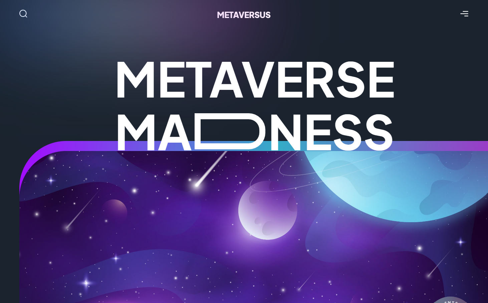
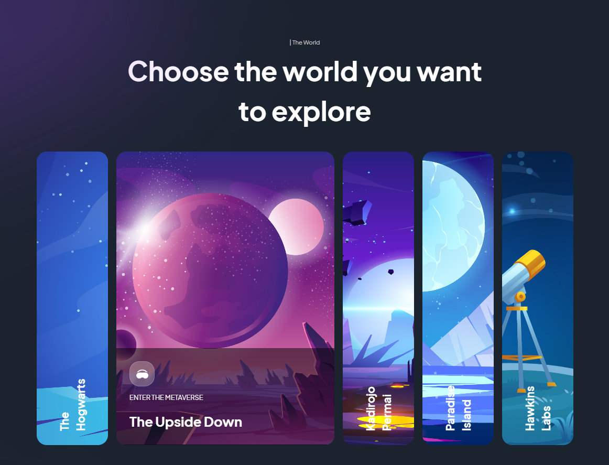

# Metaversus - Animation-Rich Landing Page




Metaversus is an animation-rich landing page built with Next.js, Tailwind CSS, and Framer Motion. This stunning and immersive website will take your visitors on a visual journey with captivating animations triggered as they scroll through each section. Whether you want to showcase your product, portfolio, or any creative content, Metaversus is the perfect choice to leave a lasting impression.

## Features

-   **Seamless Scroll Animations:** Metaversus utilizes Framer Motion to create smooth and captivating animations on scroll. Each section comes to life as users navigate through your landing page.

-   **Next.js for Speed and SEO:** Built with Next.js, Metaversus ensures excellent performance and SEO optimization, making it ideal for projects that demand both speed and visibility.

-   **Responsive Design:** Metaversus is fully responsive, ensuring that your landing page looks stunning on any device, from desktop to mobile.

-   **Tailwind CSS Styling:** Tailwind CSS is used for styling, allowing for easy customization and maintenance. Customize the colors, fonts, and overall appearance to match your brand identity.

## Getting Started

To get started with Metaversus, follow these steps:

1. **Clone the repository:**

    ```bash
    git clone https://github.com/your-username/metaversus.git
    ```

2. **Install dependencies:**

    ```bash
    cd metaversus
    npm install
    ```

3. **Start the development server:**

    ```bash
    npm run dev
    ```

    The landing page will be available at `http://localhost:3000`.

## Demo

You can see a live demo of Metaversus [here](https://metaversus-lake.vercel.app/).
